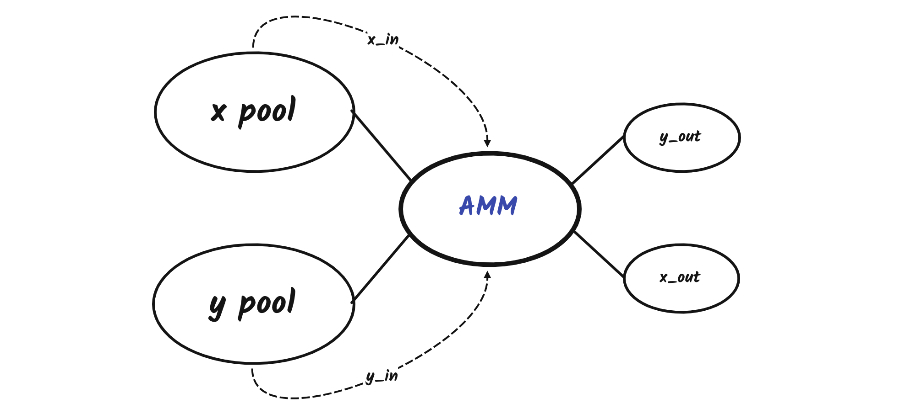

In all the AMMs, we can only trade in one direction at one instance, but the TWAMM algorithm allows trading in both directions simultaneously.

The TWAMM algorithm transforms a long-term order over a period of time into an integral of infinitely small virtual orders. The orders can go both ways at the same time. Additionally, orders executed with the same time range, in the same trading direction get pooled together to simplify the calculation. Each individual trader will get his fair share of the token based on the percentage he contributes $x_{in}$ and $y_{in}$. As a result, long-term orders over a time period are executed at the price equal to the time-weighted market price of that period.

TWAMM makes the price slippage for large orders smaller, by allowing counterparties to trade against those large orders simultaneously. In the most ideal case ($\dfrac{x_{in}}{y_{in}}=\dfrac{x_{ammStart}}{y_{ammStart}}$), zero slippage trading can be achieved. In this case, $x_{ammEnd}=x_{ammStart}$​, $y_{ammEnd}=y_{ammStart}$.

Therefore, any LongTerm Orders can be considered non-limited orders, TWAMM basically serves as an order book, which exchanges tokens between each side without providing liquidity. LongTerm orders are broken into infinitely small orders which are executed virtually between blocks. Due to this nature, it is less susceptible to sandwich attacks since the attacker has to put an order at the end of a block, and another order at the beginning of the following block.
