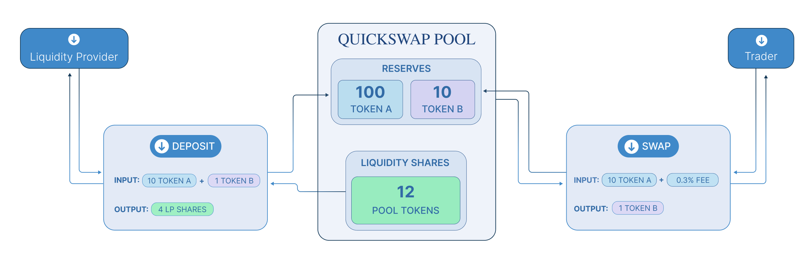
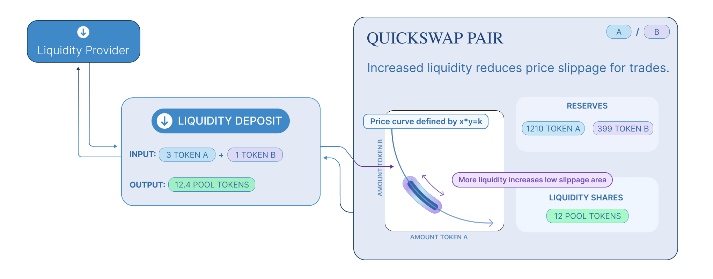
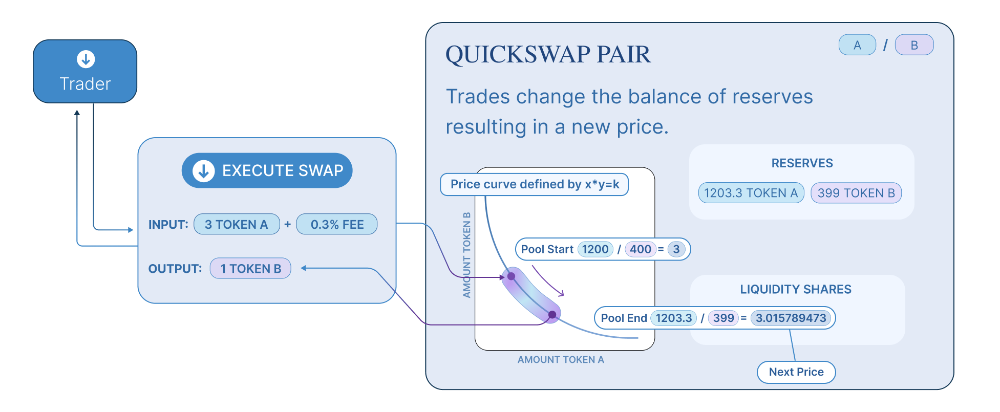

Paradigm Research Partners **Dave White**, **Dan Robinson** and Uniswap founder **Hayden Adams** have co-written an article proposing a new AMM model, the `Time-Weighted Average Market Maker (TWAMM)`, for automating the execution swap of large trades on ethereum.

For example, suppose Alice wants to buy $100 million worth of ETH on the blockchain, the best option is to manually split the order into parts and execute them over a few hours. If she sends several large sub-orders, each order will still have a significant impact on the price and be vulnerable to attacks. On the other hand, if she sends many small sub-orders, she will have to take all the risk of active trading and will pay high costs to miners in the form of gas fees per transaction.

Unlike traditional AMM models that are costly for large transactions, TWAMM splits a large transaction into a myriad of very small orders based on a dedicated order splitting logic, and swap them all virtually at the embedded AMM over time. The main goal of the embedded AMM's pricing is to smoothly execute its long-term orders over time to ensure they are executed at close to the current TWAP price.

Pulsar TWAMM contains an embedded AMM that implements most of the standard AMM functionality (liquidity provide, liquidity remove and swap). Also, the execution logic for long-term orders is split into three libraries, [`OrderPool.sol`](https://github.com/PulsarSwap/TWAMM-Contracts/blob/master/contracts/libraries/OrderPool.sol), [`LongTermOrders.sol`](https://github.com/PulsarSwap/TWAMM-Contracts/blob/master/contracts/libraries/LongTermOrders.sol) and [`BinarySearchTree.sol`](https://github.com/PulsarSwap/TWAMM-Contracts/blob/master/contracts/libraries/BinarySearchTree.sol) with each TWAMM instance facilitating [Term Swap](../02-core-concepts/02-term-swap.md) between two specific asset pairs, such as ETH and USDC.

<!-- ---

Pulsar is an _automated liquidity protocol_ powered by a [constant product formula](concepts/protocol-overview/04-glossary#constant-product-formula) and implemented in a system of non-upgradeable smart contracts on the [Ethereum](https://ethereum.org/) blockchain.
It obviates the need for trusted intermediaries, prioritizing **decentralization**, **censorship resistance**,
and **security**. Pulsar is **open-source software** licensed under the
[GPL](https://en.wikipedia.org/wiki/GNU_General_Public_License).

Each Pulsar smart contract, or pair, manages a liquidity pool made up of reserves of two [ERC-20](https://eips.ethereum.org/EIPS/eip-20) tokens.

Anyone can become a liquidity provider (LP) for a pool by depositing an equivalent value of each underlying token in return for pool tokens. These tokens track pro-rata LP shares of the total reserves, and can be redeemed for the underlying assets at any time.

Pairs act as automated market makers, standing ready to accept one token for the other as long as the “constant product” formula is preserved. This formula, most simply expressed as `x * y = k`, states that trades must not change the product (`k`) of a pair’s reserve balances (`x` and `y`). Because `k` remains unchanged from the reference frame of a trade, it is often referred to as the invariant. This formula has the desirable property that larger trades (relative to reserves) execute at exponentially worse rates than smaller ones.

In practice, Pulsar applies a 0.30% fee to trades, which is added to reserves. As a result, each trade actually increases `k`. This functions as a payout to LPs, which is realized when they burn their pool tokens to withdraw their portion of total reserves. In the future, this fee may be reduced to 0.25%, with the remaining 0.05% withheld as a protocol-wide charge.

Because the relative price of the two pair assets can only be changed through trading, divergences between the Pulsar price and external prices create arbitrage opportunities. This mechanism ensures that Pulsar prices always trend toward the market-clearing price. -->

# Further reading

<!-- To see how token swaps work in practice, and to walk through the lifecycle of a swap, check out [Swaps](../02-core-concepts/01-swaps.md). Or, to see how liquidity pools work, see [Pools](../02-core-concepts/02-pools.md). -->

Ultimately, of course, the Pulsar protocol is just smart contract code running on Ethereum. To understand how they work, head over to [Smart Contracts](02-smart-contracts.md)
