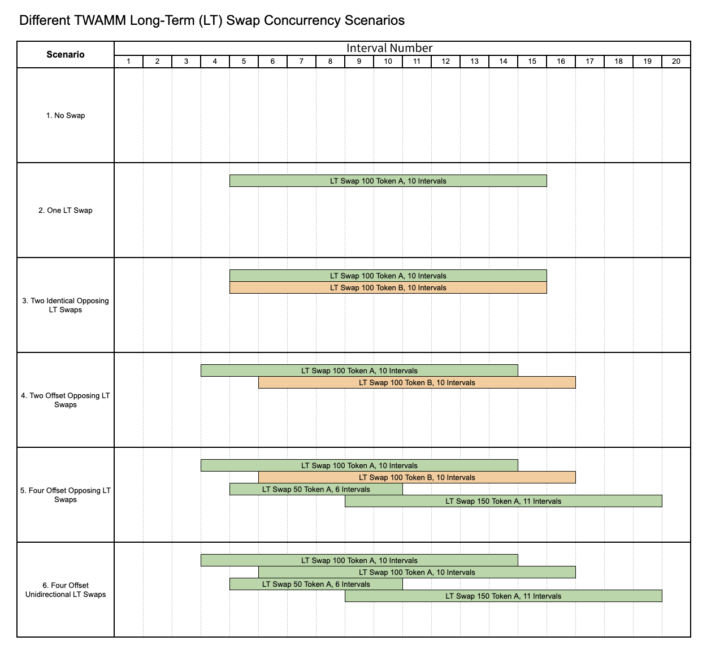

Traders can submit [LongTerm Orders](04-long-term-orders.md) to TWAMM to sell a fixed number of assets on a fixed number of blocks, and TWAMM breaks these longterm orders into an infinite number of infinitely small virtual sub-orders that trade with the embedded AMM at a uniform rate over time. Dealing with these virtual sub-orders individually would cost an infinite amount of gas, but the TWAMM closed-form mathematical formula allows their cumulative swap rewards to be calculated only when needed.

## LongTerm Swap Scenarios

[Reference Documentation](https://mirror.xyz/0slippage.eth/5zKJW4Zx9zYHpB4jNln16HuU8d8EtawmA17usNfIje4)

Another important factor in TWAMM is the LongTerm Swap(LT-swap) scenario. Real world TWAMM use would include the situation where there are one or more active LT-Swap, offset, and also occurring in opposite directions.

Consider a TWAMM pool consisting of Token A and Token B. Direction in this case refers to a swap from Token A to Token B—the opposite direction would be from Token B to Token A. Figure below illustrates some of the important possible LT swap scenarios. (In below picture , Order Interval = 5 blocks)

Unlike [Instant Swap](01-instant-swap.md) (one block) trades happening on AMMs today, we expect the trades on TWAMM to be particularly advantageous to long-term investors such as DAOs, funds, etc, and retail who are interested in utilizing TWAMM to enter/exit positions. Additionally, passive LPs who’ve been craving for a full range AMM since UNI V3 can now park their liquidity in TWAMM pools to earn significant returns without active management.
