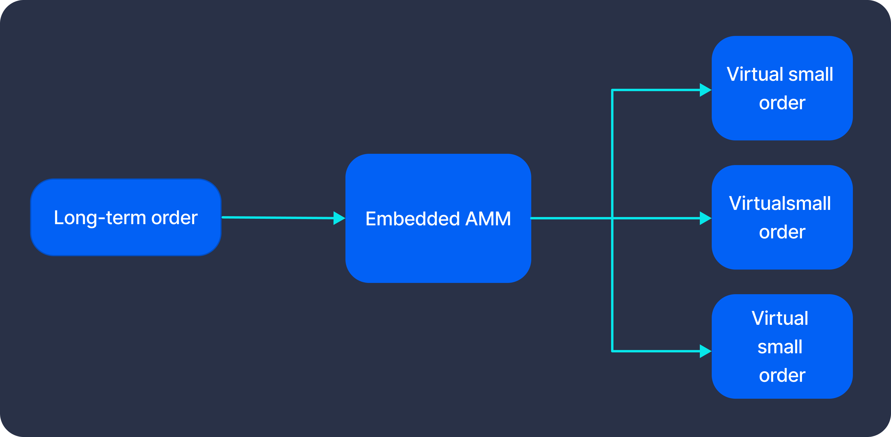
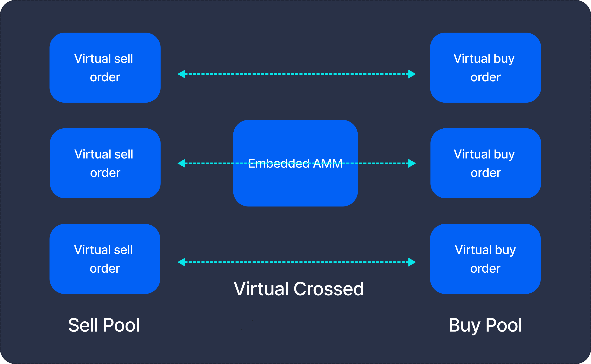
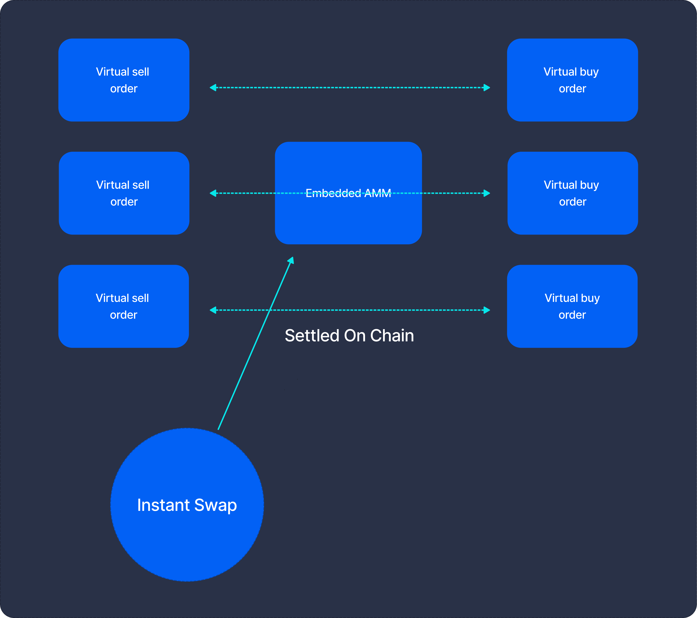
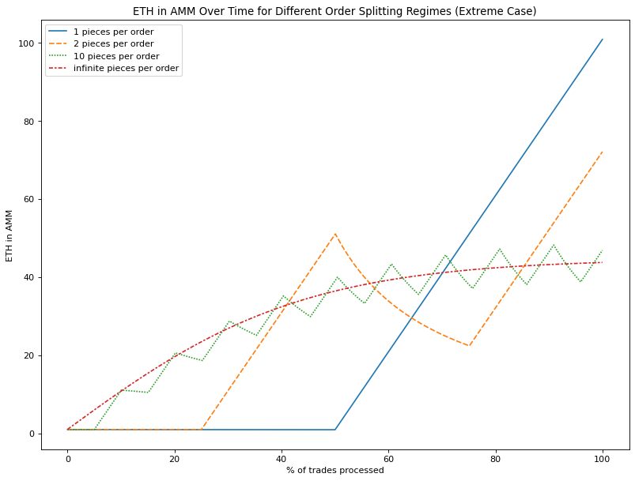

​The TWAMM splits large orders into many small virtual orders and executes them slowly over time.

Virtual orders aren't executed on-chain (as they would incur gas), but the Embedded AMM accounts for them. In this scenario, the buy & sell orders are virtually crossed and the on-chain [settlement](04-order-execution.md) takes place later.

When the Embedded AMM receives a regular [Instant Swap](../02-core-concepts/01-instant-swap.md) buy/sell order or a new large order [Term Swap](../02-core-concepts/02-term-swap.md), it will "wake up" & calculate the results of all the virtual trades that have taken place in the time that has since elapsed. In this example, the virtual buy and sell orders that have been virtually crossed will be settled.

And there we have it, a DeFi-native novel way to TWAP a large order without incurring insane gas fees or causing too great of a price impact! Paradigm's diagram illustrates this concept in a very neat way.

