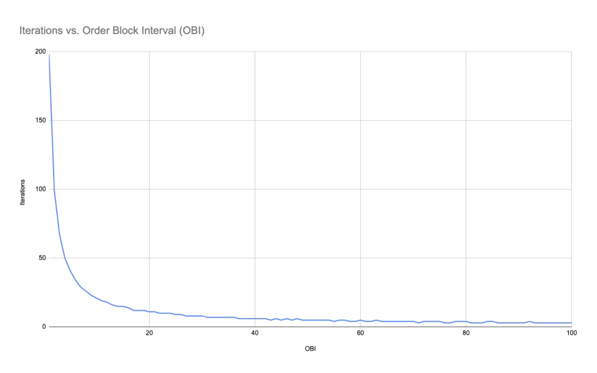
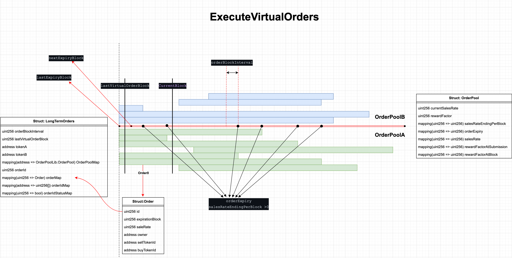

<!-- [Reference Documentation](https://mirror.xyz/0slippage.eth/5zKJW4Zx9zYHpB4jNln16HuU8d8EtawmA17usNfIje4) -->

Once an order expires, TWAMM executes a virtual long-term orders, which is not a real swap, but only a calculation of the accumulated swap proceeds until the user cancels the long-term orders or the order expires in full, and then directly withdraws the corresponding tokens according to the accumulated swap proceeds.

Computing the result of the closed-form mathematical formula described in [Mathematical Principle of TWAMM](05-mathematical-principle-of-twamm.md) can alternately be described as performing a virtual order execution iteration, where each iteration occurs at a specific block height. Pulsar use [`Binary Search Tree (BST)`](../01-protocol-overview/02-smart-contracts.md#binarysearchtree) which is used to store and organize all the nodes that are long-term order expiration block heights.The block where each iteration occurs is controlled by the [OBI](03-order-block-interval.md) and when the order pool was deployed. Importantly, OBI will be shown to significantly reduce gas usage by reducing the number of iterations that the closed form mathematical formula need be computed for periods of inactivity during active Term Swaps.

If no TWAMM operations necessitating virtual order execution occur for an arbitrary number of blocks, a.k.a. blocks of inactivity, the next TWAMM operation requiring virtual order execution incurs the cost of executing all the virtual orders since the last such operation.

<!-- The number of virtual order execution iterations incurred for a given block number in such a scenario can be calculated with the following formula: -->

<!-- $$VOEIterations = 1 + Floor(\dfrac{BN-LVOB+(LVOB \mod\ OBI)}{OBI})$$

Where:

- VOE Iterations = Virtual Order Execution Iterations
- BN = Block Number
- LVOB = Last Virtual Order Block
- OBI = Order Block Interval

The inverse relationship in equationa bove between iterations and OBI suggests that for pairs with significant inactivity, larger order block intervals may be appropriate to reduce gas usage. To illustrate this relationship, consider a TWAMM pair last updated at block 1000, the Last Virtual Order Block (LVOB), with a new TWAMM operation requiring virtual order execution issued at the current block, BN, 1201. Equation above can be used to plot the number of iterations against the OBI for this 201 block inactivity scenario:

 -->

The result of the Order Execution of TWAMM long-term orders at expiration is as follows:

$$x_{ammEnd}=\sqrt{\dfrac{kx_{in}}{y_{in}}}\cdot\dfrac{e^{2\sqrt{\dfrac{x_{in}y_{in}}{k}}}+c}{e^{2\sqrt{\dfrac{x_{in}y_{in}}{k}}} -c}$$

$$x_{out}=x_{ammStart}+x_{in}-x_{ammEnd}$$

$$y_{ammEnd}=\sqrt{\dfrac{ky_{in}}{x_{in}}}\cdot\dfrac{e^{2\sqrt{\dfrac{x_{in}y_{in}}{k}}}+\overline{c}}{e^{2\sqrt{\dfrac{x_{in}y _{in}}{k}}}-\overline{c}}$$

$$y_{out}=y_{ammStart}+y_{in}-y_{ammEnd}$$

$$c=\dfrac{\sqrt{x_{ammStart}\cdot y_{in}}-\sqrt{y_{ammStart}\cdot x_{in}}}{\sqrt{x_{ammStart}\cdot y_{in}}+\sqrt{y_{ammStar t}\cdot x _{in}}}=-\overline{c}$$

$$e^{2\sqrt{\dfrac{x_{in}y_{in}}{k}}}>\left\lvert \dfrac{\sqrt{x_{ammStart}\cdot y_{in}}-\sqrt{y_{ammStart}\cdot x_{in}}}{\sqrt{x_{ammStart}\cdot y_{in}}+\sqrt{y_{ ammStart}\cdot x_{in}}}\right\rvert$$

